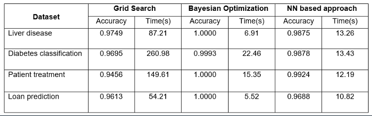

# 🔍 Neural Network Based Hyperparameter Optimization for Random Forest Models

Welcome to the repository for the research project "Neural Network Based Hyperparameter Optimization for Random Forest Models", conducted as part of the undergraduate research at the Department of Computer Engineering, University of Sri Jayewardenepura.

⚡ This project proposes a meta-learning approach using a neural network to predict the most suitable hyperparameters for Random Forest classifiers based on dataset characteristics. The model significantly reduces the computational cost of traditional methods while maintaining high accuracy.

---

## 📁 Project Structure

```
Hyperparameter_Optimization/
├── Docs/
│   ├── Research_paper.pdf
│   └── Research_presentation.pdf
│
├── Meta_dataset_creation_notebooks/
│   └── [Notebooks for Meta-dataset Generation Using 10 Datasets]
│
├── Train_neural_network/
│   └── Neural Network Training Notebook 
│
├── Test_notebooks/
│   └── Accuracy & Time Comparisons 
│
├── Training_datasets/
│   └── [10 Datasets for Meta-dataset Creation]
│
├── Test_datasets/
│   └── [4 Datasets Used for Final Testing]
│
└── meta_dataset.csv
```

---

## 🧠 Project Highlights

### 📌 Objective

Traditional hyperparameter optimization methods like Grid Search and Random Search are accurate but computationally expensive. This project introduces a binary classification-based neural network model trained on a meta-dataset of Random Forest configurations and dataset characteristics to predict the most suitable hyperparameters quickly and efficiently.

### 🔧 Methodology

- Select datasets to create the meta dataset
- Define hyperparameter grid with selected hyperparameters
- Evaluate hyperparameter combinations using traditional methods
- Create a meta-dataset with dataset characteristics and accuracy
- Design a neural network to predict accuracy for hyperparameters
- Train the neural network on the meta-dataset
- Predict hyperparameters for new datasets using the trained model

### 📊 Meta-Dataset

The `meta_dataset.csv` includes:

- Dataset-level features: sample count, feature count, class imbalance ratios, no. of categorical and numerical features
- Hyperparameters: n_estimators, max_depth, max_features, min_samples_split
- Corresponding classification accuracies 

### ⚙️ Tools & Technologies

- Google Colab (for all development and training)
- Python, Scikit-learn, TensorFlow/Keras, Pandas, NumPy
- Random Forest Classifier
- Neural Networks for binary classification

---

## 📈 Performance Overview



The neural network model achieves highly competitive accuracy while significantly reducing time compared to Grid Search, making it a powerful alternative with low computational cost.

---

## 📑 Documentation

- 📄 Research Paper (available in Docs folder)
- 📊 Presentation Slides (available in Docs folder)

These documents provide full insight into the methodology, design, experiments, and results of the project.

---

## 💡 Future Work

- Extend support to multi-class and regression problems
- Improve prediction to output hyperparameter combinations directly
- Integrate with AutoML frameworks for enhanced pipelines

---

## 🙌 Acknowledgements

This research was conducted under the guidance and support of the Department of Computer Engineering, Faculty of Engineering, University of Sri Jayewardenepura.

---

## 📬 Contact

**Thithira Paranawithana**  
📧 thithiraparanawithana@gmail.com  
📍 Sri Lanka
